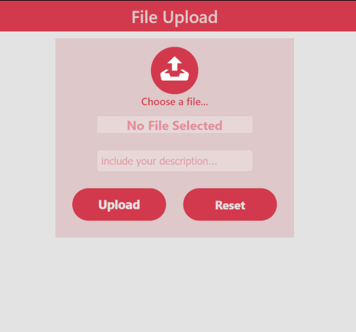
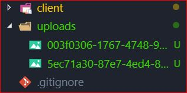

# File Upload



## Description

A personal expermental project. Creating, Learning, and dug deep on app that Fetching file from local directory and place file in temp placeholder then Upload/Post it. Before Upload/post, it first Generating unique id with extension called `uuid` into new file name, Post the file into local apps directory (uploads) using nodejs middleware called `multer`. (Can also be posted into firebase, mongodb, or any other storages). Done user friendly UI stying with "rose theme" (why not!). 


*unique file name stored inside apps after uploaded*



****
## Usage

### Installation
Installall server-side dependencies
```
yarn install
```

Install client-side dependencies
```
yarn install-client
```

### Serve

Run front-end (client) & back-end (server) concurrently
```
yarn start
```